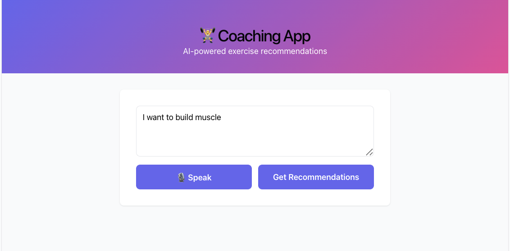
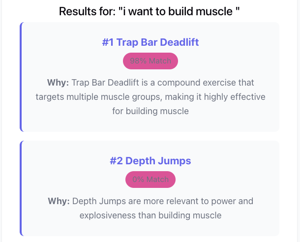

# LLM Coaching App

A minimal LLM-powered coaching app that recommends exercises based on user queries. Uses Llama model via Groq API for intelligent re-ranking.

**Stack:** Python (FastAPI) + PostgreSQL + React + Llama LLM





---

## Files

```
├── config.py               App configuration
├── schema.sql              Database schema
├── load_data.py            CSV → PostgreSQL
├── engine.py               Core engine (retrieval + Llama ranking)
├── app.py                  FastAPI REST server
├── App.jsx                 React UI component
├── App.css                 Styling
├── requirements.txt        Pip dependencies
└── environment.yml         Conda environment
```

**Docker Files (Optional) **
- `Dockerfile.min` - Production container
- `docker-compose.min.yml` - Full stack

---

## Pre-requirements

### 1. Install Dependencies

**Option A: Using conda (recommended)**
```bash
conda env create -f environment.yml
conda activate llm_coach_env
```

**Option B: Using pip**
```bash
pip install -r requirements.txt
```

### 2. Setup Database

Before running the database load script, make sure data is in place:
1. Create `data/` directory if missing: `mkdir -p data`
2. Copy or move `exercises.csv` into `data/`:
   `cp path/to/exercises.csv data/exercises.csv`

If `psql` reports `role "postgres" does not exist`, run:
```bash
createuser -s postgres

```

**Prerequisites:** Install pgvector extension for PostgreSQL vector support.

```bash
brew install pgvector
```

Then continue:
```bash
createdb coaching_app_db
psql coaching_app_db < schema.sql
python load_data.py data/exercises.csv
```

### 3. Configure
```bash
export GROK_API_KEY="your_key_from_https://console.groq.com/"
```

### 4. Run Backend
In the terminal run:
```bash
python app.py
# or: uvicorn app:app --reload
```

API available at: http://localhost:8000

### 5. Run Frontend
In a different terminal run:
```bash
npm create vite@latest frontend -- --template react
cd frontend
npm install axios
```
**Copy App.jsx and App.css to src/**
```bash
cp ../App.jsx src/
cp ../App.css src/
```
**Run Frontend**
```bash
npm run dev
```

App at: http://localhost:5173/

### 6. Voice query 
- Click the `🎙️ Speak` button to start microphone capture.
- Browser speech-to-text fills the query text area and automatically triggers recommendation.
- If speech recognition is not supported, an alert explains browser requirements.
- Uses Web Speech API (`SpeechRecognition` or `webkitSpeechRecognition`).

---

## System Architecture
```bash
┌─ User Query ────────────────────────────────────┐
│                                                 │
│  1. RETRIEVAL (Keyword Search)                  │
│     └─ SQL: Search description + tags           │
│     └─ Returns: ~20 candidate exercises         │
│                                                 │
│  2. RE-RANKING (Llama LLM via Groq)             │
│     └─ Send candidates to Llama API             │
│     └─ Get JSON with scores + reasoning         │
│     └─ Returns: Top 5 ranked exercises          │
│                                                 │
│  3. LOGGING (Analytics)                         │
│     └─ Store query + results in database        │
│                                                 │
└─ Response with reasoning ─────────────────────-─┘
```

---

## API Endpoints

| Method | Path | Purpose |
|--------|------|---------|
| GET | `/health` | System status |
| POST | `/recommend` | **Main: Get recommendations** |
| GET | `/exercises/{id}` | Exercise details |
| POST | `/users/onboard` | Save user profile |

### Example: /recommend
```bash
curl -X POST http://localhost:8000/recommend \
  -H "Content-Type: application/json" \
  -d '{"query": "knee pain low-impact", "top_k": 5}'
```

**Response:**
```json
{
  "query": "knee pain low-impact",
  "recommendations": [
    {
      "rank": 1,
      "id": "EX_001",
      "title": "Single-Leg Box Squat",
      "score": 0.98,
      "reasoning": "Directly addresses knee rehab + low-impact unilateral movement"
    }
  ]
}
```

---

## Core Components

### engine.py

**Class: Engine**

1. **retrieve(query, top_k=20)**
   - Keyword search on description/tags
   - Returns list of exercise dicts
   - SQL: `WHERE description ILIKE %query% OR tags ILIKE %query%`

2. **rank_with_grok(query, exercises, top_k=5)**
   - Builds prompt with exercises
   - Calls Llama API via Groq (llama-3.3-70b-versatile model)
   - Parses JSON response
   - Returns Recommendation objects
   
   **Prompt format:**
   ```
   Rank these exercises by relevance to: "{query}"
   
   1. Title: Description
   2. Title: Description
   ...
   
   Return ONLY valid JSON:
   {"rankings": [{"num": 1, "score": 95, "reason": "..."}]}
   ```

3. **recommend(query, user_id=None, top_k=5)**
   - Orchestrates: retrieve → rank → log
   - Returns dict with recommendations
   - Logs to database for analytics

### app.py 
**REST API Server**

```python
from fastapi import FastAPI
from engine import Engine

app = FastAPI()
engine = Engine(db_url, grok_key)

@app.post("/recommend")
async def get_recommendations(req: RecommendationRequest):
    return engine.recommend(req.query, req.user_id, req.top_k)
```

---

## Database Schema

### exercises
```sql
id VARCHAR(50)           -- EX_001
title VARCHAR(255)       -- Single-Leg Box Squat
description TEXT         -- Controlled unilateral squat...
tags TEXT                -- squat, unilateral, lower
body_part VARCHAR(100)   -- lower, upper, core
difficulty VARCHAR(50)   -- beginner, intermediate, advanced
equipment VARCHAR(255)   -- dumbbells, barbell, bodyweight
injury_focus VARCHAR(255)-- knee rehab, shoulder rehab
intensity VARCHAR(50)    -- low, medium, high
```

### query_logs
```sql
user_id VARCHAR(100)     -- user_123
query TEXT               -- Original user query
retrieved_ids TEXT       -- JSON: ["EX_001", "EX_002"]
ranked_ids TEXT          -- JSON: ["EX_001"]
response_time_ms INTEGER -- 1250
created_at TIMESTAMP     -- 2024-01-15T10:30:00
```

### user_profiles
```sql
user_id VARCHAR(100)     -- user_123
goals TEXT               -- JSON: ["strength", "rehab"]
constraints TEXT         -- JSON: {"equipment": [...]}
preferences TEXT         -- JSON: {"intensity": "low"}
```

---

## How It Works

### Example: Query = "Explosive drills for a winger"

**Step 1: Retrieve (~50ms)**
```sql
SELECT * FROM exercises
WHERE description ILIKE '%explosive%'
   OR tags ILIKE '%explosive%'
   OR title ILIKE '%plyometric%'
LIMIT 20
```

Results: Depth Jumps, Single-Leg Hops, Sprint Intervals, etc.

**Step 2: Re-rank with Llama via Groq (~1-3s)**

Prompt to Llama:
```
Rank these exercises by relevance to: "Explosive drills for a winger"

1. Depth Jumps: Explosive jump with minimal ground contact
2. Single-Leg Hop: Explosive unilateral hop
3. Sprint Intervals: High intensity sprint work
...

Return JSON: {"rankings": [{"num": 1, "score": 98, "reason": "..."}]}
```

Llama Response:
```json
{
  "rankings": [
    {"num": 1, "score": 98, "reason": "Perfect for explosive power + athletic performance"},
    {"num": 2, "score": 95, "reason": "Develops explosive power + unilateral agility"},
    {"num": 3, "score": 87, "reason": "Explosive acceleration crucial for wing play"}
  ]
}
```

**Step 3: Return Results**
```json
{
  "recommendations": [
    {"rank": 1, "title": "Depth Jumps", "score": 0.98, "reasoning": "Perfect for..."},
    {"rank": 2, "title": "Single-Leg Hop", "score": 0.95, "reasoning": "Develops..."},
    {"rank": 3, "title": "Sprint Intervals", "score": 0.87, "reasoning": "Explosive..."}
  ]
}
```

---

## Testing

```bash
# Test health
curl http://localhost:8000/health

# Test recommendation (no Grok needed for fallback)
curl -X POST http://localhost:8000/recommend \
  -d '{"query":"squat"}'
```
---

## Docker Deployment

### Build & Run
```bash
docker build -f Dockerfile.min -t coaching-app .
docker run -p 8000:8000 -e GROK_API_KEY=your_key coaching-app
```

### Full Stack
```bash
docker-compose -f docker-compose.min.yml up -d
```

---

## Next Steps

1. Add more exercises to CSV
2. Customize LLM prompt in engine.py
3. Add user interaction tracking
4. Implement vector embeddings for semantic search
5. Deploy to production

---

## Dependencies

```
fastapi==0.104.1
uvicorn==0.24.0
psycopg2-binary==2.9.9
requests==2.31.0
pydantic==2.5.0
pytest==7.4.3
python-dotenv==1.0.0
```

---
